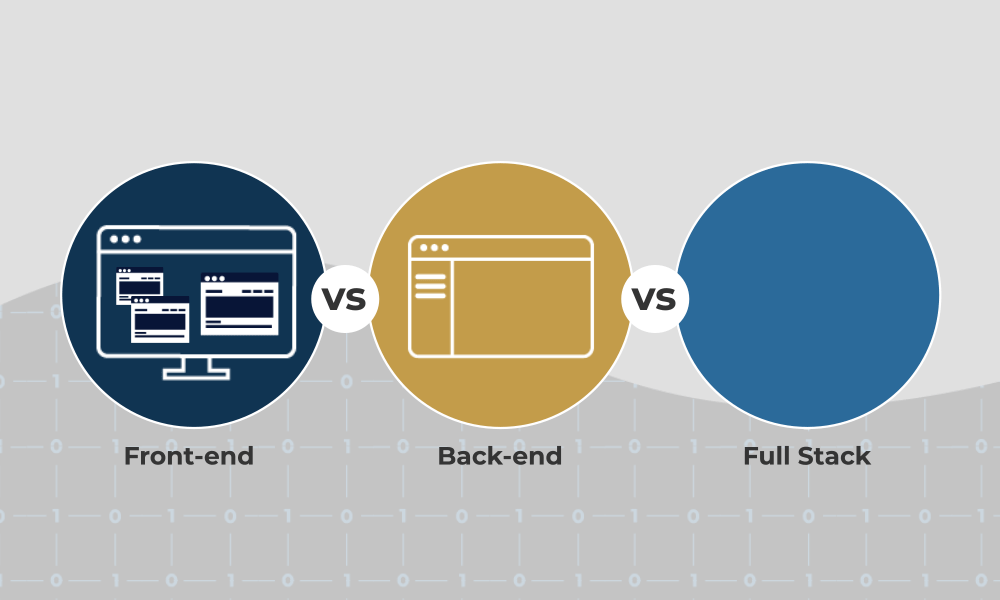

  

  

 

  

  As a Full Stack Software Engineer with 7 years of web development and 4 years remote background, I have successfully developed and published several web and mobile applications using modern JavaScript Frameworks and Libraries such as React(Primary), Vue, Next, Nuxt for the frontend and Node.js/Express.js(Primary) and Python/Django/Flask/PHP(laravel) for the backend.

  Now I'm learning and developing automation project and trading view project.
  And try to getting degree of AI, Machine Learning.

  Skilled in working under pressure and adapting to new situations and challenges to contribute to the company's success.Collaborate with creative and development teams on the execution of ideas and projects.

####      
                                             

<h2 font-weight="bold">Process</h2>

<h2 font-weight="bold">My machine</h2>

   
<h2 font-weight="bold">𝐒𝐤𝐢𝐥𝐥s</h2>

<table align="center">
  <tr>
    <td align="center" width="90">
      
       React
    </td>
    <td align="center" width="90">
      
       Redux
    </td>
    <td align="center" width="90">
      
       Next.js
    </td>
    <td align="center" width="90">
      
       Gatsby
    </td>
    <td align="center" width="90">
      
       Vue
    </td>
    <td align="center" width="90">
      
       Nuxt.js
    </td>
    <td align="center" width="90">
      
       Angular
    </td>
    <td align="center" width="90">
      
       Nest.js
    </td>
    <td align="center" width="90">
      
       Node.js
    </td>
    <td align="center" width="90">
      
       Express
    </td>
  </tr>
  <tr>
    <td align="center" width="90">
      
       Svelte
    </td>
    <td align="center" width="90">
      
       WordPress
    </td>
    <td align="center" width="90">
      
       Typescript
    </td>
    <td align="center" width="90">
      
       PHP
    </td>
    <td align="center" width="90">
      
       Laravel
    </td>
    <td align="center" width="90">
      
       Python
    </td>
    <td align="center" width="90">
      
       Django
    </td>
    <td align="center" width="90">
      
       Flask
    </td>
    <td align="center" width="90">
      
       Ruby
    </td>
    <td align="center" width="90">
      
       RestAPI
    </td>
  </tr>
  <tr>
    <td align="center" width="90">
      
       D3.js
    </td>
    <td align="center" width="90">
      
       MaterialUI
    </td>
    <td align="center" width="90">
      
       Tailwind
    </td>
    <td align="center" width="90">
      
       HTML
    </td>
    <td align="center" width="90">
      
       CSS
    </td>
    <td align="center" width="90">
      
       Sass
    </td>
    <td align="center" width="90">
      
       Bootstrap
    </td>
    <td align="center" width="90">
      
       Babel
    </td>
    <td align="center" width="90">
      
       Three.js
    </td>
    <td align="center" width="90">
      
       Solidity
    </td>
  </tr>
  <tr>
    <td align="center" width="90">
      
       AWS
    </td>
    <td align="center" width="90">
      
       MDB
    </td>
    <td align="center" width="90">
      
       MySQL
    </td>
    <td align="center" width="90">
      
       PostgreSQL
    </td>
    <td align="center" width="90">
      
       SQLite
    </td>
    <td align="center" width="90">
      
       Flutter
    </td>
    <td align="center" width="90">
      
       Android
    </td>
    <td align="center" width="90">
      
       Java
    </td>
    <td align="center" width="90">
      
       C#
    </td>
    <td align="center" width="90">
      
       C++
    </td>
  </tr>
</table>

<h2 font-weight="bold">My work style :)</h2>

  <table align="center">
    <tr>
      <td>
         
      </td>
      <td>
          
      </td>
    </tr>
  </table>

